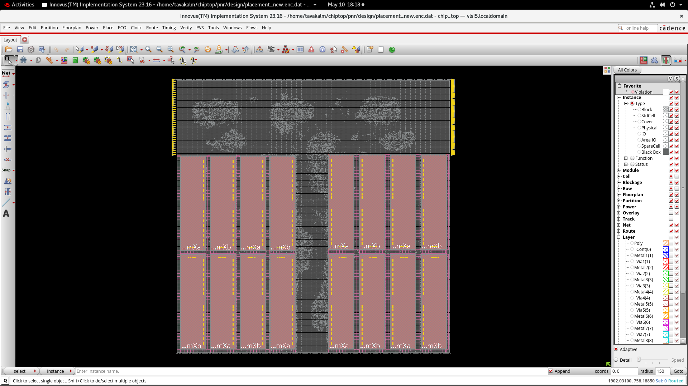
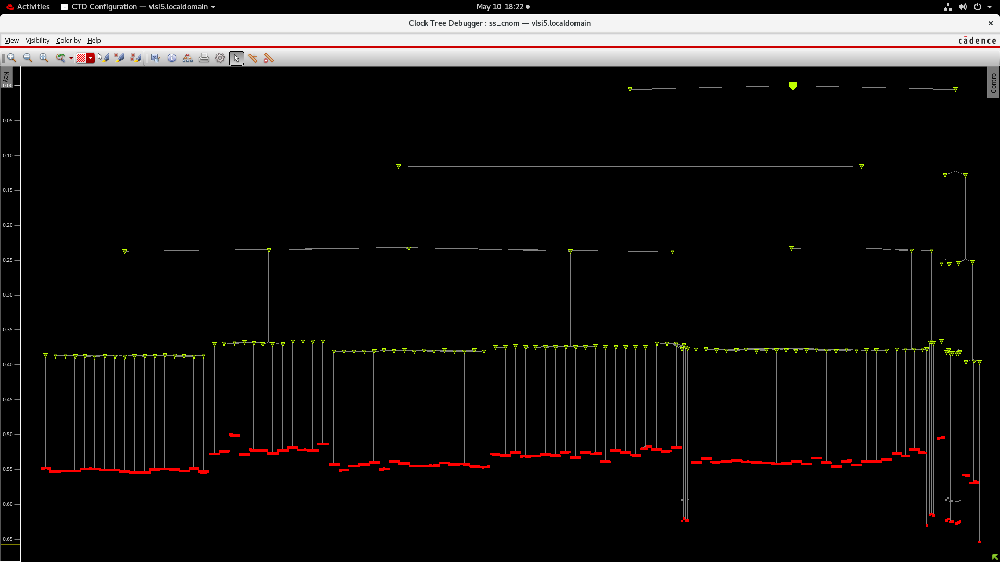
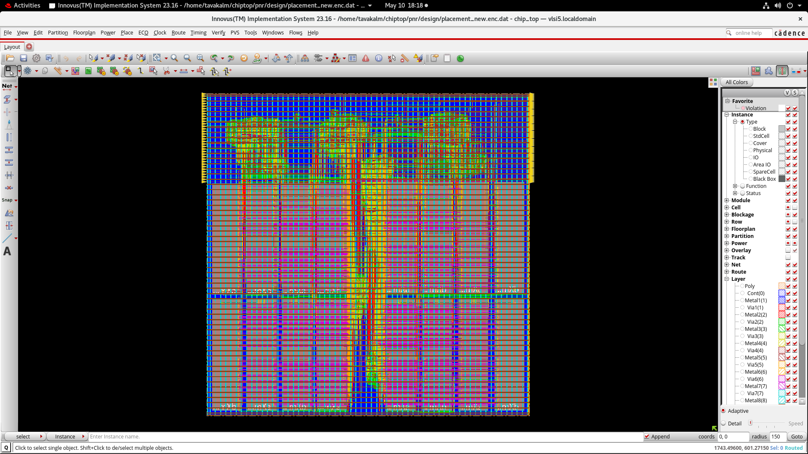
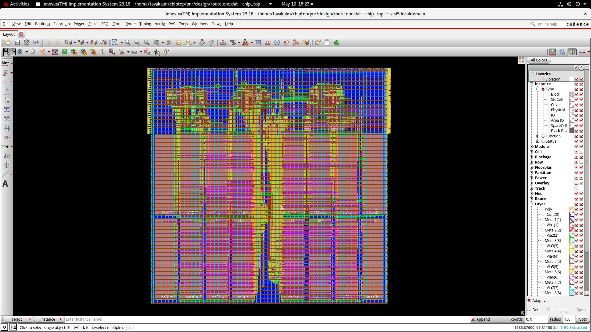
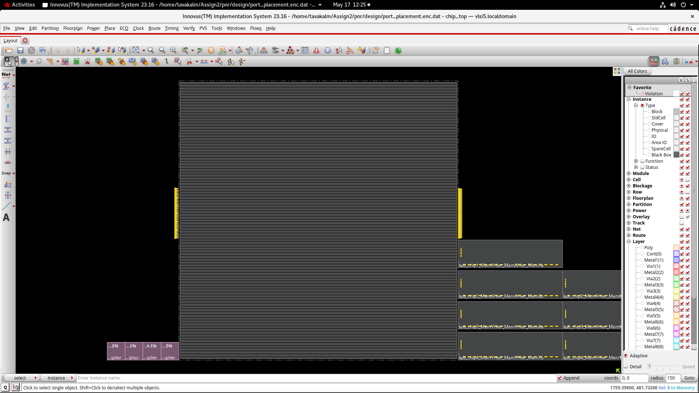
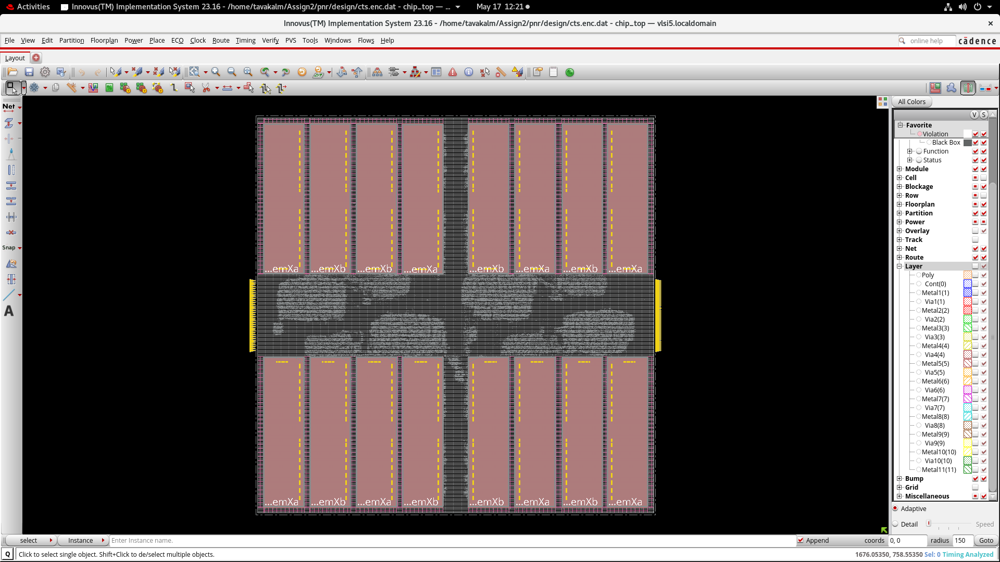
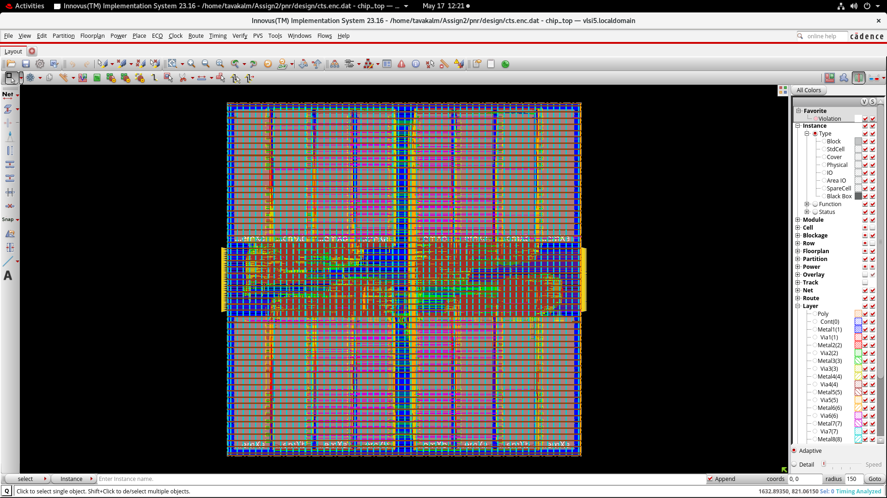
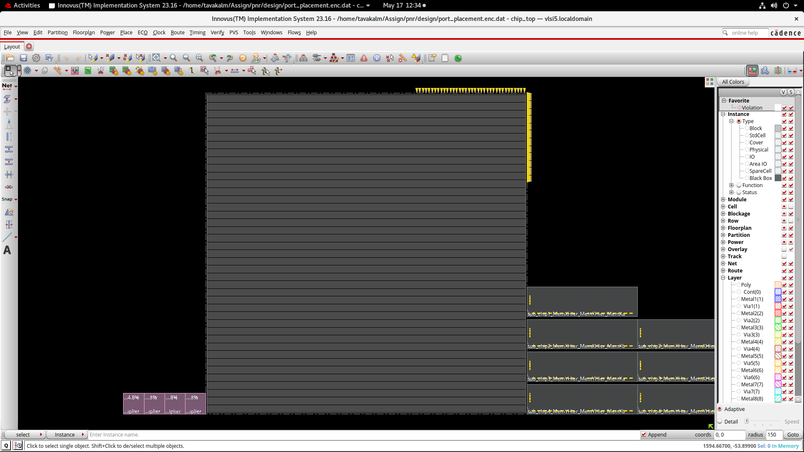
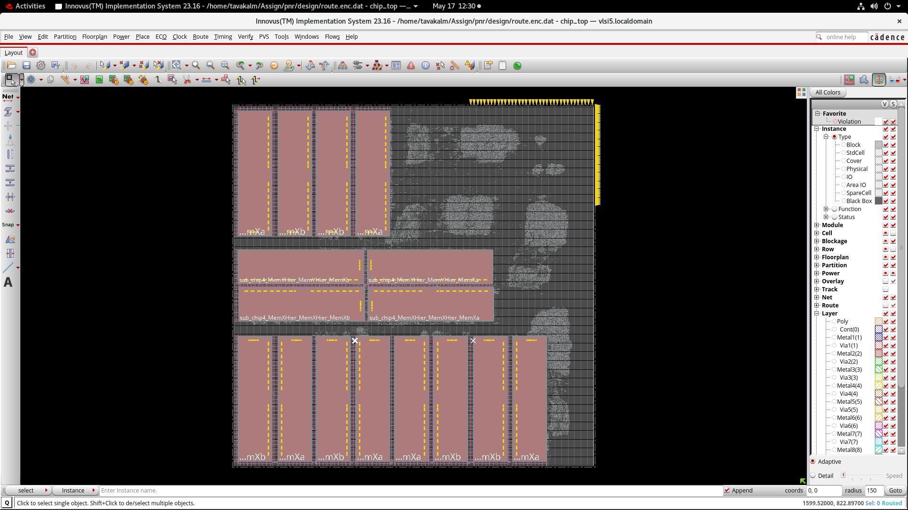
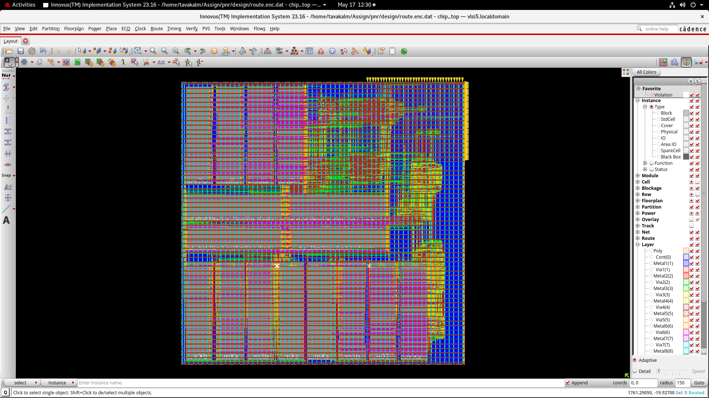

# ChipTop ASIC Physical Design (RTL-to-GDSII)

🚀 Complete ASIC RTL-to-GDSII Physical Design implementation with timing optimization and routing closure using Cadence Innovus.

---

## 📌 Overview

This project demonstrates a complete ASIC Physical Design flow for a ChipTop design, starting from synthesized netlist import through floorplanning, macro placement, placement, clock tree synthesis, routing, timing analysis, and final layout generation using industry-standard Cadence tools.

---

## 🔧 Tools Used

- Cadence Innovus (Physical Design)
- Cadence Genus (Synthesis)
- TCL Scripting
- Linux Environment

---

## ⚙️ Physical Design Flow

- Netlist Import
- Floorplanning
- Macro Placement
- Power Planning
- Standard Cell Placement
- Clock Tree Synthesis (CTS)
- Routing
- Timing Analysis
- Physical Verification

---

## 📊 Implementation Results

- Successfully completed RTL-to-GDSII flow
- Achieved routing completion with optimized congestion
- Generated timing and QoR reports
- Multiple implementation stages automated using TCL scripts
- Final routed design generated successfully

---


## 🖼️ Physical Design Flow Snapshots

### 🔹 Floorplan


### 🔹 Macro Placement


### 🔹 Placement


### 🔹 Clock Tree Synthesis (CTS)


### 🔹 Routing


### 🔹 Final Layout


---

# 🔄 Design Evolution & Optimization Journey

This project underwent multiple implementation iterations to improve congestion, placement quality, timing closure, and routing quality.

## Iteration 1 — Initial Design

### Floorplan


### Placement


### Routing


Observation:
- Initial implementation with baseline QoR
- Congestion hotspots observed

---

## Iteration 2 — Optimization Phase

### Floorplan


### Placement


### Routing


Observation:
- Placement optimization performed
- Improved routing and timing behavior

---

## Final Design

Achieved:

✅ Positive timing slack  
✅ Connectivity clean  
✅ Routing completed  
✅ QoR reports generated  
---

## 🧠 Key Observations

- Successful completion of Physical Design flow
- Balanced placement and routing structure
- Efficient TCL-based automation flow
- Generated multiple timing and QoR reports
- Achieved clean routed implementation

---

# 🖼️ Physical Design Flow Snapshots

## 🔹 Floorplan


---

## 🔹 Macro Placement


---

## 🔹 Placement


---

## 🔹 Clock Tree Synthesis (CTS)


---

## 🔹 Routing


---

## 🔹 Final Layout


---

## 📊 ChipTop ASIC Design Results Summary

| Parameter | Value |
|------------|--------|
| Setup Violations | 0 (Positive slack) |
| Hold Violations | No violations |
| Standard Cell Count (Initial) | 20035 |
| Standard Cell Count (After Routing) | 49706 |
| Total Area | 1537290.0 |
| Combinational Cells Count | 17179 |
| Sequential Cells Count | 2856 |
| Area Utilization (Initial) | 54.831852% |
| Area Utilization (After Routing) | 59.539831% |
| DRC Violations | 0 |
| PG Shorts | 0 |
| Connectivity Violations | 0 |

---

# 📁 Project Structure

```text
inputs/          → Netlists, constraints, LEF/LIB files
scripts/         → TCL automation scripts
reports/         → QoR and implementation reports
timingReports/   → Timing analysis reports
outputs/         → DEF and routed outputs
screenshots/     → Design stage snapshots
```

---

# 🚀 Key Learnings

- Complete ASIC RTL-to-GDSII Physical Design Flow
- Placement and routing optimization
- Congestion analysis and reduction
- Clock Tree Synthesis optimization
- Timing report analysis
- TCL scripting automation in Innovus

---

# 🎯 Highlights

- Complete Physical Design implementation
- Industry-standard Cadence tool usage
- Automated TCL-based implementation flow
- Multi-stage design optimization
- Final routed layout generation

---

# 👨‍💻 Author

**Tavakalmastan**
