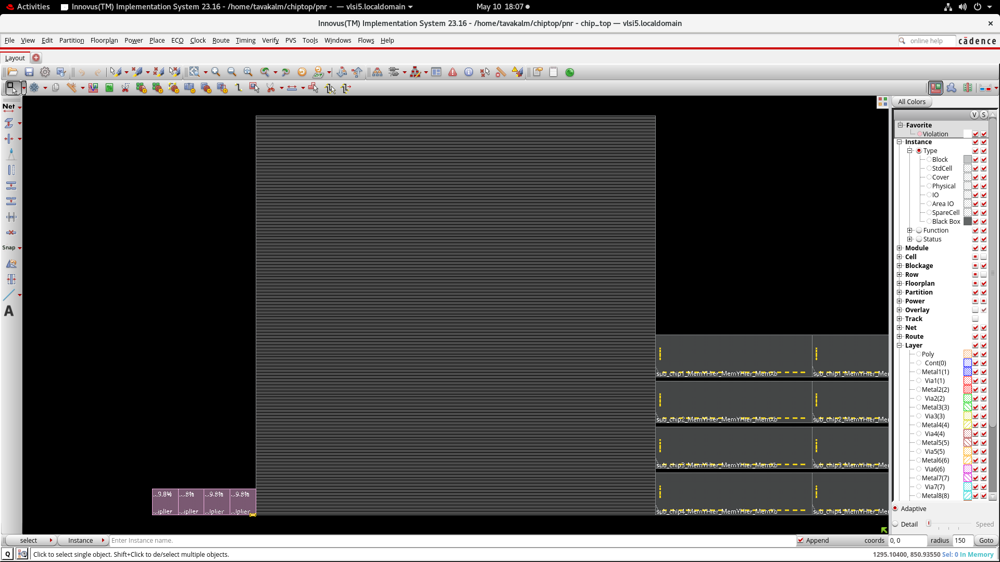
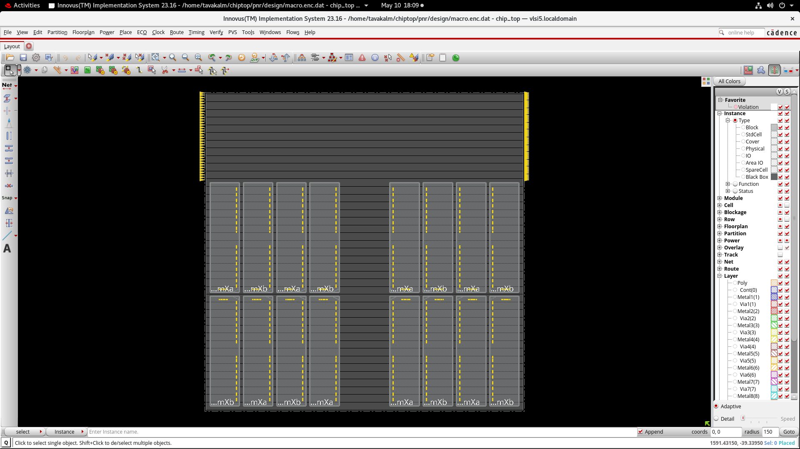

# ChipTop ASIC Physical Design Project

## Overview
This project demonstrates a complete RTL-to-GDSII ASIC Physical Design flow using Cadence Innovus.

## Physical Design Flow
- Floorplanning
- Macro Placement
- Standard Cell Placement
- Clock Tree Synthesis (CTS)
- Routing
- Timing Closure
- Physical Verification

## Tools Used
- Cadence Innovus
- Cadence Genus
- TCL Scripting
- Linux Environment

## Project Structure
- inputs/ → Design inputs and constraints
- scripts/ → TCL automation scripts
- reports/ → QoR and implementation reports
- timingReports/ → Timing analysis reports
- outputs/ → DEF and routed outputs
- screenshots/ → Physical design stage snapshots

# Physical Design Flow Snapshots

## Floorplan

## Macro Placement

## Placement

## Clock Tree Synthesis (CTS)

## Routing

## Final Layout

## Key Learnings
- RTL-to-GDSII ASIC implementation flow
- Timing optimization and closure
- Congestion handling
- CTS balancing
- Routing optimization
- TCL automation scripting
